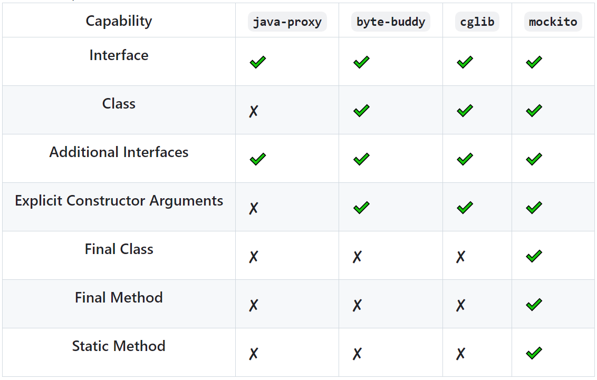

该项目是一个Spock 2.x单测框架的使用案例，演示了一些Spock的用法：数据驱动测试、Mock用法、静态方法、final的mock，以及闭包等用法。  
项目主要依赖如下：
 - Spring Boot 3.4.4
 - Spock 2.4-M5-groovy-4.0
 - Java 21

### Spock2.x 新增特性
1. 支持静态方法和final类的mock(内置支持了mockito扩展)，不用再单独引入powermock或jmockit(单测会更简洁)，目前已支持的列表如下：  
   
2. 基于Junit 5

相关文档：  
[mock静态方法](https://spockframework.org/spock/docs/2.4-M4/interaction_based_testing.html#MockingStaticMethods)  
[mock扩展](https://spockframework.org/spock/docs/2.4-M4/extensions.html#mock-makers)

注：如果你是junit4的项目还想使用spock，请参考 [主分支](https://github.com/lucas-myx/spock_example/tree/master) 的示例代码或官方提供的[迁移手册](https://spockframework.org/spock/docs/2.3/migration_guide.html) 升级到spock2.x junit5
